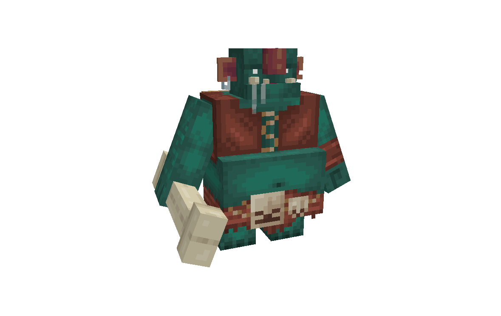

# Inhabitants
_Work in Progress_

A Minecraft mod that adds new fictional fauna.
So far, 10 new mobs are planned, each with unique behaviors and interactions.

## Credits
- [@JeremySeq](https://jeremyseq.dev/): lead coder
- [@Catalyst](https://x.com/Catalyst2000251): artist, animator, and designer
- [@mattseq](https://www.curseforge.com/members/mattseq/projects): coder

## Completed Mobs

The following mobs are fully implemented and functional in the game.

**Bogre**

A large, tough swamp creature with mossy skin. It moves slowly but hits hard. You can tame it with fish; it can make chowder for you and can carve bones into weapons.

