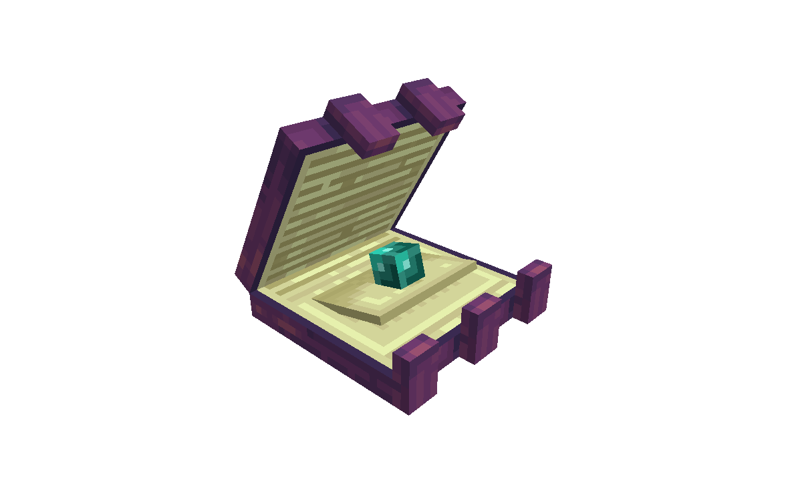
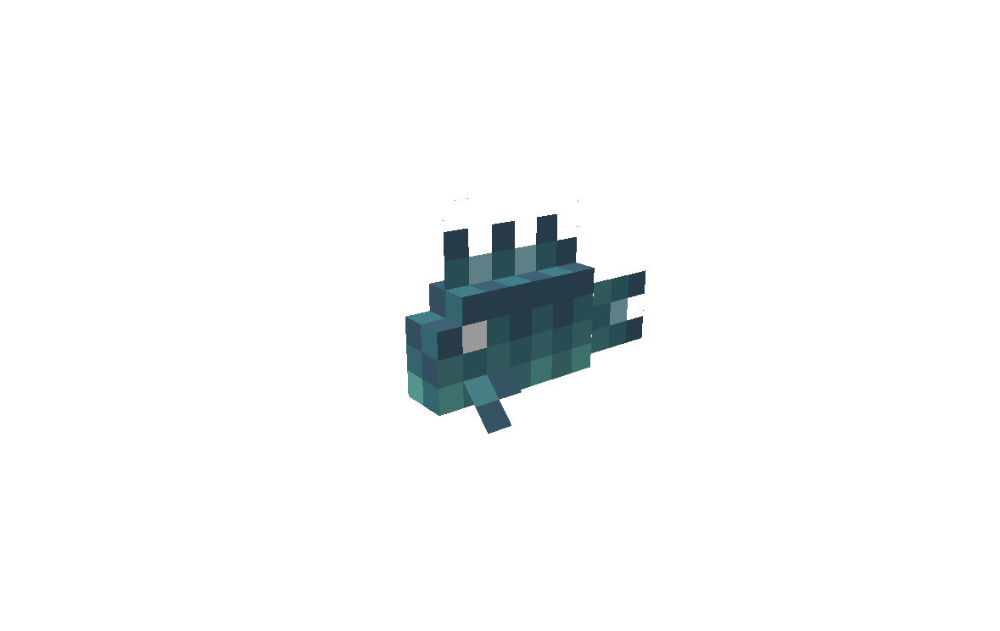

# Inhabitants
_Work in Progress_

A Minecraft mod that adds new fictional fauna.
So far, 10 new mobs are planned, each with unique behaviors and interactions.

## Credits
- [@JeremySeq](https://jeremyseq.dev/): lead coder
- [@Catalyst](https://x.com/Catalyst2000251): artist, animator, and designer
- [@mattseq](https://www.curseforge.com/members/mattseq/projects): coder

## Completed Mobs

The following mobs are fully implemented and functional in the game.

**Bogre**

A large ogre-like creature that lives in the swamp. It moves slowly but hits hard. You can tame it with fish; it can make chowder for you and can carve bones into weapons.

**Warped Clam**

A passive End creature that launches players into the air when stepped on, which is especially useful if you have an Elytra. It only takes damage when it opens. Players can use a brush on it to harvest ender pearls and can pick it up using a shovel.

**Abyssfish**

A glowing fish found deep in the ocean. It can be caught while fishing and cooked like cod, or brewed into a Potion of Adaptation that lets you see clearly underwater and in lava.

